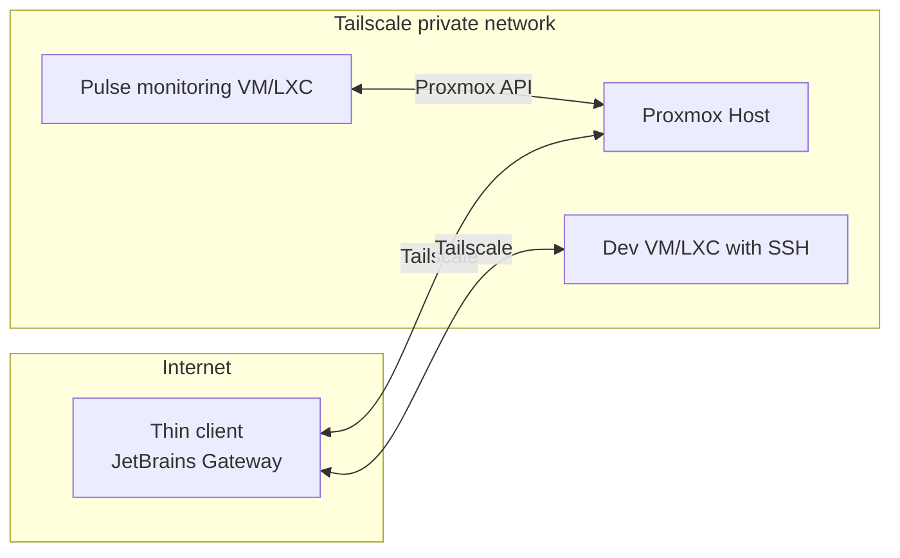

# JV-BFOR519-SysAdmin-Project
## Proxmox + Tailscale + Pulse + JetBrains Gateway

### Secure, remote-friendly homelab:

- Proxmox host for VMs and LXC containers
- Private remote access with Tailscale
- Pulse dashboard to view Proxmox, VM/LXC status, and alerts
- Remote IDE workflow with JetBrains Gateway as thin client and JetBrains IDEs hosted on VMs/LXCs

## Goals

- Set up a Proxmox server you can reach securely from anywhere
- See VM and container health at a glance
- Get notified when something goes wrong
- Work on code through a remote IDE with low local hardware needs

## Project relevance

This project ties together tools that are useful to me now and expandable later. Proxmox gives me a central place to run VMs and containers. Tailscale lets me reach that environment securely from anywhere. Pulse keeps an eye on Proxmox and my workloads. JetBrains Gateway turns the dev VM into a central development server I can use from a low-power laptop.

In terms of systems administration skills, this setup lets me practice:

- Building and maintaining a virtualized server platform
- Managing secure remote access for admin and development work
- Monitoring host and guest resources and responding to issues
- Planning for future services, like adding n8n workflows or hosting a Minecraft server for friends on the same infrastructure

It is both a practical homelab I will keep using and a small “production-like” environment that matches real sysadmin tasks.

## Architecture

## Stack

- Proxmox VE (host)

- Tailscale (private mesh VPN, SSH, HTTPS certs)

- Pulse (Proxmox-focused monitoring and alerts)

- JetBrains Gateway (remote IDE access to a dev VM/LXC)

## Prerequisites

Proxmox VE installed and reachable on your local network

A Tailscale account

Basic Linux familiarity (SSH, apt)
