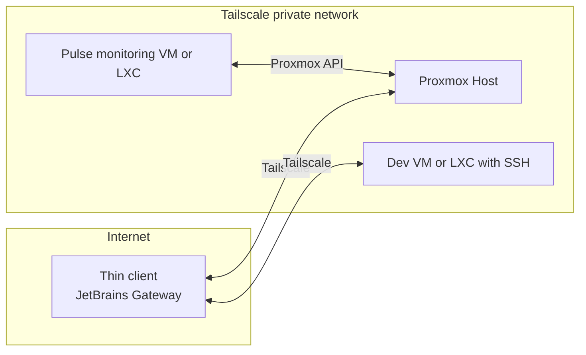

# JV-BFOR519-SysAdmin-Project
## Proxmox + Tailscale + Pulse + JetBrains Gateway

This project builds a secure, remote friendly homelab that I can reach from anywhere.  
Proxmox runs the VMs and containers, Tailscale handles private remote access, Pulse monitors Proxmox, and JetBrains Gateway gives me a remote IDE on a dev VM.

---

## Goals

* Set up a Proxmox server that is reachable securely from anywhere  
* See VM and container health at a glance  
* Get notified when something goes wrong  
* Work on code through a remote IDE with low local hardware needs  
* Build a setup that can grow later for more services and workflows  

---

## Project relevance

This project ties together tools that I can use right now as a central development server and that I can extend in the future.

From a systems administration point of view this setup lets me practice:

* Installing and maintaining a virtualized server platform with Proxmox  
* Managing secure remote access for admin and development work using Tailscale  
* Monitoring host and guest resources and responding to alerts with Pulse  
* Running a remote IDE workflow through JetBrains Gateway  
* Planning for future services such as n8n workflows or a game server that can live on the same platform  

It is both a practical homelab that I will keep using and a small environment similar to a production setup.

---

## Architecture

## Stack

- Proxmox VE (host)  
- Tailscale (private mesh VPN, SSH, HTTPS certs)  
- Pulse (Proxmox focused monitoring and alerts)  
- JetBrains Gateway (remote IDE access to a dev VM or LXC)  

---

## Prerequisites

- Proxmox VE installed and reachable on your local network  
- A Tailscale account  
- Basic Linux familiarity (SSH, `apt`)  
- A JetBrains IDE that works with Gateway  

---

## Methodology

High level build steps:

1. Install Proxmox VE on the bare metal host and configure storage and basic networking.  
2. Create initial VMs or LXCs and confirm local access to the Proxmox web UI.  
3. Join the Proxmox host to my Tailscale Tailnet and test access to the UI and SSH over Tailscale.  
4. Deploy Pulse in a VM or LXC and connect it to the Proxmox API, then add checks and alerts for host and guests.  
5. Create a dev VM, install the IDE backend, and connect to it from JetBrains Gateway over Tailscale.  
6. Document each phase with notes, commands, and screenshots in the Phase folders.  

See the Phase folders for detailed steps and screenshots.

---

## Results overview

High level outcomes:

### Phase 1 (Proxmox)

Bare metal host now runs Proxmox with working storage and networking and is ready for remote access and monitoring.

### Phase 2 (Tailscale)

Proxmox host is enrolled in Tailscale and the web UI and SSH are reachable over the Tailnet. Public exposure is reduced to the local network and Tailnet.

### Phase 3 (Pulse)

Pulse is deployed and connected to the Proxmox API. Basic health checks and alerts for VMs, containers, and the host are working.

### Phase 4 (JetBrains Gateway and dev VM)

Dev VM is set up with the IDE backend. I can connect to it from a lower power PC through JetBrains Gateway over Tailscale and do development work there. Screenshots and notes are in the Phase 4 markdown files.

For full details, screenshots, and step by step notes see the Phase folders.

---

## How this is used in practice

A typical workflow looks like this:

1. Connect the thin client laptop or PC to the internet.  
2. Start Tailscale and join the Tailnet.  
3. Open the Proxmox UI over Tailscale for admin tasks.  
4. Use JetBrains Gateway on the client to connect to the dev VM over Tailscale.  
5. Let Pulse monitor the Proxmox host and guests and alert if something goes wrong.  

This keeps heavy workloads on the Proxmox server while I use a light laptop or PC as the front end.

---

## Repository structure

### README.md

- [`README.md`](./README.md)  
  Main overview of the project, architecture, and results.

### Timeline.md

- [`Timeline.md`](./Timeline.md)  
  Notes on the project schedule and milestones.

### Phase-1

- [`Phase-1-CoreSetUp-RESULTS.md`](./Phase-1/Phase-1-CoreSetUp-RESULTS.md)  
  Results and summary of the Proxmox installation and base setup.  

- [`Phase-1-CoreSetUp-DETAILS.md`](./Phase-1/Phase-1-CoreSetUp-DETAILS.md)  
  Install notes and screenshots for getting Proxmox onto the server.

### Phase-2

- [`Phase-2-Tailscale-RESULTS.md`](./Phase-2/Phase-2-Tailscale-RESULTS.md)  
  Results and screenshots for setting up Tailscale and securing remote access.  

- [`Phase-2-Tailscale-DETAILS.md`](./Phase-2/Phase-2-Tailscale-DETAILS.md)  
  Extra notes on Tailscale commands and configuration.  

- [`Phase-2-What-Is-Tailscale.md`](./Phase-2/Phase-2-What-Is-Tailscale.md)  
  Short overview of what Tailscale is and why I use it in this project.

### Phase-3

- [`Phase-3`](./Phase-3/)  
  Pulse monitoring docs for Proxmox including results and install details.

### Phase-4

- [`Phase-4-Jetbrains-VM-RESULTS.md`](./Phase-4/Phase-4-Jetbrains-VM-RESULTS.md)  
  Results and screenshots for the dev VM and JetBrains Gateway remote IDE workflow.  

- [`Phase-4-Jetbrains-VM-DETAILS.md`](./Phase-4/Phase-4-Jetbrains-VM-DETAILS.md)  
  Steps for creating the Ubuntu VM, joining it to the Tailnet, setting up Git, and connecting with JetBrains Gateway.

---

## Conclusion and next steps

This project turns a single Proxmox host into a small managed environment with secure remote access, monitoring, and a remote development workflow. Along the way I practiced:

- Building and managing a virtualized server platform  
- Using Tailscale to provide private remote access instead of opening ports on the internet  
- Deploying a dedicated monitoring service and wiring it into Proxmox  
- Running a remote IDE backend so development happens on the server, not on the local machine  

There is still room to grow this setup. Possible improvements and extensions include:

- Adding more Pulse alerts for storage, CPU, memory, and backup status  
- Documenting common troubleshooting steps for Tailscale, Pulse, and the dev VM  
- Hosting more services on the Proxmox host, such as an n8n instance, a small game server, or other lab tools, and managing them with the same access and monitoring patterns  

Overall, this project shows how a homelab server can be treated more like a real environment that is secure, monitored, and ready to support new services as needs grow.

